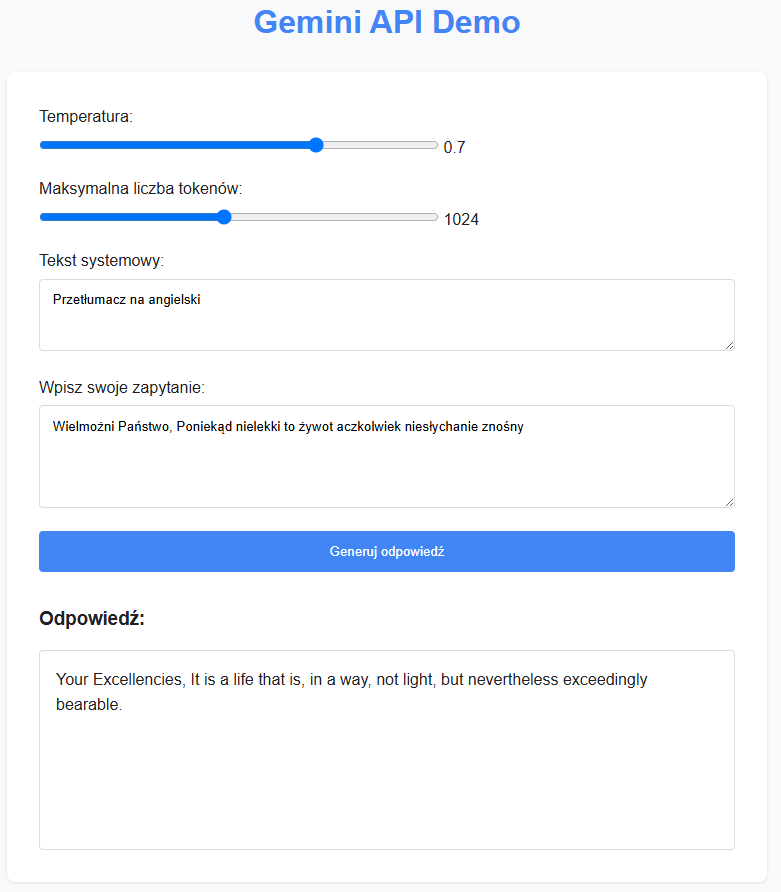

# Aplikacja Flask

Flask to lekki, ale potężny framework webowy dla Pythona, który umożliwia tworzenie pełnoprawnych aplikacji internetowych. W przeciwieństwie do Streamlit, który jest bardziej specjalizowany pod kątem aplikacji data science, Flask daje pełną kontrolę nad architekturą, wyglądem i zachowaniem aplikacji. Pozwala na tworzenie profesjonalnych interfejsów użytkownika, zarządzanie sesjami, integrację z bazami danych i implementację API RESTful. Jest idealny gdy potrzebujesz większej elastyczności lub planujesz rozwijać aplikację w kierunku produkcyjnym.



## Przygotowanie środowiska do aplikacji Flask

1. **Aktualizacja pliku requirements.txt**
   Możesz dodać wartość "flask" do pliku `requirements.txt` i zainstalować:
   ```bash
   pip install -r requirements.txt
   ```

2. **Utworzenie struktury katalogów**
   ```bash
   mkdir -p templates static/css static/js
   ```

## Kod aplikacji Flask (flask_app.py)

Możesz wykorzystać GitHub Copilot do wygenerowania kodu aplikacji Flask:

```
Stwórz aplikację Flask do komunikacji z Gemini API z:
- back-end: endpoint /generate obsługujący zapytania POST
- front-end: strona HTML z suwakami (temperatura, liczba tokenów), 
  polami tekstowymi (instrukcja systemowa, zapytanie) i przyciskiem
- komunikacja front-back przez fetch API
Wykorzystaj funkcję generate_response() z gemini_api.py
```

Przykładowy kod:

```python
from flask import Flask, render_template, request, jsonify
from gemini_api import generate_response

app = Flask(__name__)

@app.route('/')
def index():
    return render_template('index.html')

@app.route('/generate', methods=['POST'])
def generate():
    data = request.json
    user_prompt = data.get('prompt', '')
    system_prompt = data.get('system_prompt', '')
    temperature = float(data.get('temperature', 0.7))
    max_tokens = int(data.get('max_tokens', 1024))
    
    if user_prompt:
        response_text = generate_response(
            prompt=user_prompt,
            system_prompt=system_prompt,
            temperature=temperature,
            max_tokens=max_tokens
        )
        return jsonify({'response': response_text})
    else:
        return jsonify({'error': 'Brak zapytania.'}), 400

if __name__ == '__main__':
    app.run(debug=True)
```

## Szablon HTML (templates/index.html)

```html
<!DOCTYPE html>
<html lang="pl">
<head>
    <meta charset="UTF-8">
    <meta name="viewport" content="width=device-width, initial-scale=1.0">
    <title>Gemini API - Aplikacja Flask</title>
    <style>
        body { font-family: Arial, sans-serif; max-width: 800px; margin: 0 auto; padding: 20px; }
        .container { display: flex; flex-direction: column; gap: 15px; }
        label { font-weight: bold; }
        textarea { width: 100%; padding: 8px; }
        button { padding: 10px; background-color: #4285f4; color: white; border: none; cursor: pointer; }
        #result { margin-top: 20px; padding: 15px; border: 1px solid #ddd; min-height: 200px; }
    </style>
</head>
<body>
    <h1>Gemini API Demo</h1>
    <div class="container">
        <div>
            <label for="temperature">Temperatura:</label>
            <input type="range" id="temperature" min="0" max="1" step="0.1" value="0.7">
            <span id="temperatureValue">0.7</span>
        </div>
        
        <div>
            <label for="maxTokens">Maksymalna liczba tokenów:</label>
            <input type="range" id="maxTokens" min="100" max="2048" step="50" value="1024">
            <span id="maxTokensValue">1024</span>
        </div>
        
        <div>
            <label for="systemPrompt">Tekst systemowy:</label>
            <textarea id="systemPrompt" rows="3">Jesteś pomocnym asystentem AI.</textarea>
        </div>
        
        <div>
            <label for="userPrompt">Wpisz swoje zapytanie:</label>
            <textarea id="userPrompt" rows="5"></textarea>
        </div>
        
        <button id="generateBtn">Generuj odpowiedź</button>
        
        <div>
            <h3>Odpowiedź:</h3>
            <div id="result"></div>
        </div>
    </div>

    <script>
        // Aktualizacja wartości suwaków
        document.getElementById('temperature').addEventListener('input', function() {
            document.getElementById('temperatureValue').textContent = this.value;
        });
        
        document.getElementById('maxTokens').addEventListener('input', function() {
            document.getElementById('maxTokensValue').textContent = this.value;
        });
        
        // Obsługa generowania odpowiedzi
        document.getElementById('generateBtn').addEventListener('click', async function() {
            const userPrompt = document.getElementById('userPrompt').value;
            const systemPrompt = document.getElementById('systemPrompt').value;
            const temperature = document.getElementById('temperature').value;
            const maxTokens = document.getElementById('maxTokens').value;
            const resultDiv = document.getElementById('result');
            
            if (!userPrompt) {
                resultDiv.textContent = 'Proszę wprowadzić zapytanie.';
                return;
            }
            
            resultDiv.textContent = 'Generowanie odpowiedzi...';
            
            try {
                const response = await fetch('/generate', {
                    method: 'POST',
                    headers: {
                        'Content-Type': 'application/json',
                    },
                    body: JSON.stringify({
                        prompt: userPrompt,
                        system_prompt: systemPrompt,
                        temperature: temperature,
                        max_tokens: maxTokens
                    }),
                });
                
                const data = await response.json();
                if (data.error) {
                    resultDiv.textContent = `Błąd: ${data.error}`;
                } else {
                    resultDiv.textContent = data.response;
                }
            } catch (error) {
                resultDiv.textContent = `Błąd: ${error.message}`;
            }
        });
    </script>
</body>
</html>
```

## Struktura katalogów dla aplikacji Flask

```
gemini_projekt/
├── gemini_api.py                # Wspólny moduł API
├── flask_app.py                 # Główny kod aplikacji Flask
├── templates/                   # Katalog szablonów HTML
│   └── index.html               # Strona główna aplikacji
├── static/                      # Katalog dla plików statycznych
│   ├── css/                     # Style CSS
│   └── js/                      # Skrypty JavaScript
├── .env                         # Plik z kluczem API
├── .gitignore                   # Ignorowane pliki w Git
└── requirements.txt             # Wymagane zależności
```

## Uruchamianie aplikacji

Aby uruchomić aplikację Flask:

```bash
python flask_app.py
```

Aplikacja będzie dostępna w przeglądarce pod adresem http://localhost:5000.

Po zaimplementowaniu aplikacji Flask, zapisz zmiany w repozytorium (krok opcjonalny — best practice):

```bash
git add flask_app.py templates/ static/
git commit -m "Implementacja aplikacji webowej Flask"
```

## Zalety aplikacji Flask

1. **Pełna kontrola** - elastyczność w projektowaniu architektury i interfejsu
2. **Skalowalność** - możliwość łatwego rozszerzania funkcjonalności
3. **RESTful API** - tworzenie API dla innych aplikacji
4. **Integracja z bazami danych** - łatwa współpraca z bazami (np. SQLAlchemy)
5. **Złożone aplikacje** - możliwość budowania zaawansowanych aplikacji produkcyjnych

## Podsumowanie

Gratulacje! Ukończyłeś pełny cykl tworzenia aplikacji wykorzystujących modele językowe Gemini. Podczas tego laboratoriom nauczyłeś się:

1. Używać API Gemini poprzez [prostą aplikację terminalową](wprowadzenie-terminal.md)
2. Tworzyć aplikacje desktopowe przy użyciu [Tkinter i PySide6](aplikacje-desktopowe.md)
3. Budować interaktywne interfejsy webowe z [Streamlit](aplikacja-streamlit.md)
4. Implementować zaawansowane aplikacje webowe z Flask

Te umiejętności dają Ci solidne podstawy do tworzenia własnych narzędzi i rozwiązań opartych na sztucznej inteligencji. Możesz teraz eksperymentować z własnymi pomysłami, łącząc poznane techniki z innymi technologiami i bibliotekami.